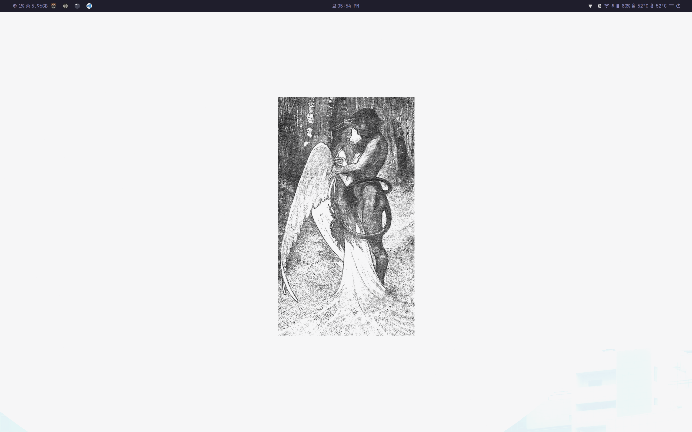
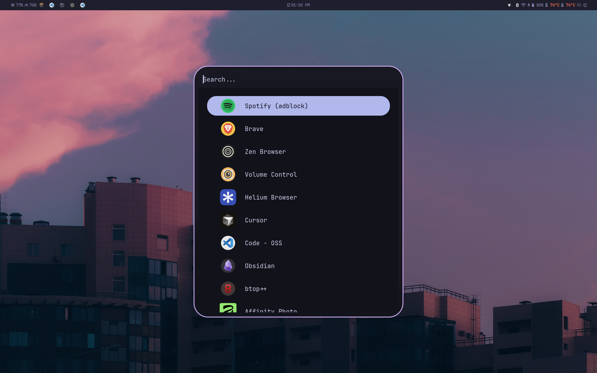

# Arch Hyprland Dotfiles

This repo tracks my actual Arch Linux desktop environment, centered around Hyprland and a HyDE-based setup. It is not just a window manager config dump. It includes the shell, theming, session glue, terminal setup, utility scripts, and lockscreen tweaks I use to keep the whole environment consistent.

## Preview

  
  

## What is in here

- `hypr/`, `waybar/`, `rofi/`, `wlogout/`: compositor and desktop UI
- `kitty/`, `zsh/`, `starship/`, `vim/`: terminal, shell, prompt, editor
- `gtk-3.0/`, `qt5ct/`, `qt6ct/`, `Kvantum/`, `nwg-look/`: theming and toolkit config
- `uwsm/`: session startup and environment handling
- `scripts/` and helper scripts in repo root: machine-specific utilities and workflow helpers
- `fastfetch/`, `btop/`: terminal utilities I keep configured with the rest of the environment

## Notes

- This repo is for my own environment first, so some paths and choices are intentionally personal.
- The Hyprlock setup uses the regular HyDE lockscreen flow with fingerprint support enabled through `hypr/hyprlock.conf` and `.local/share/hyde/hyprlock.conf`.
- Some directories exist because Linux theming is split across GTK, Qt, shell, and session tools, not because each one is used directly every day.

## Setup style

The goal here is a clean Hyprland desktop with:

- HyDE-style visuals and lockscreen flow
- Waybar and Rofi for daily navigation
- a themed shell and terminal environment
- utility scripts for system/workflow shortcuts
- dotfiles that reflect the whole environment, not only one app

## Using the repo

If you want to reuse parts of it, copy only what matches your own setup. The safest way is to take individual folders such as `hypr/`, `waybar/`, `rofi/`, `kitty/`, or `zsh/` instead of blindly copying the whole repo.

If you are cloning this for a similar Arch + Hyprland setup, expect to adjust:

- usernames and home-directory paths
- monitor/workstation-specific preferences
- package choices for GTK/Qt theming
- machine-specific helper scripts

